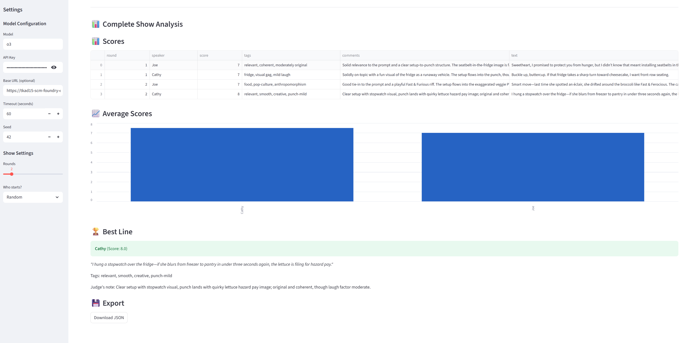

# 🎭 Improv Duo: Cathy & Joe (with a Critic)

An interactive AI-powered improv comedy show featuring two comedian agents (Cathy and Joe) who perform based on audience suggestions, with real-time evaluation by a critic agent. Built with Streamlit and AutoGen (ag2).

## 📸 Screenshots


*Real-time improv performance with live scoring*


*Complete show analysis with scores and best lines*

## 🌟 Features

- **Interactive Improv Performance**: Two AI comedians perform improvised comedy based on user suggestions
- **Real-time Streaming**: Watch the show unfold line by line with live scoring
- **Critic Feedback System**: Each line is evaluated by an AI critic using a comedy rubric
- **Adaptive Performance**: Comedians receive and respond to critic feedback in subsequent rounds
- **Customizable Settings**: Control rounds, starting comedian, and model parameters
- **Export Functionality**: Save complete show transcripts and analytics as JSON

## 📋 Prerequisites

- Python 3.10 or higher
- Azure OpenAI API access (or OpenAI-compatible endpoint)
- API key for your chosen LLM provider

## 🚀 Installation

1. Clone the repository:
```bash
git clone <repository-url>
cd comedians
```

2. Create a virtual environment (recommended):
```bash
python -m venv venv

# On Windows
venv\Scripts\activate

# On Linux/macOS
source venv/bin/activate
```

3. Install dependencies:
```bash
pip install -r requirements.txt
```

4. Set up environment variables:
   - Copy `.env.example` to `.env` (or create a new `.env` file)
   - Add your Azure OpenAI credentials:
```env
AZURE_OPENAI_API_KEY=your-api-key-here
AZURE_OPENAI_API_VERSION=2024-12-01-preview
AZURE_OPENAI_ENDPOINT=https://your-endpoint.cognitiveservices.azure.com/
AZURE_OPENAI_MODEL=your-deployment-name
```

## 🎮 Usage

1. Run the Streamlit app:
```bash
streamlit run app.py
```

2. Configure settings in the sidebar:
   - **Model Configuration**: Set API credentials and model parameters
   - **Show Settings**: Choose number of rounds and starting comedian

3. Enter an audience suggestion (e.g., "airport security", "first date", "technology")

4. Click "Run Show" to start the performance


5. Watch as:
   - Comedians take turns performing
   - Each line is evaluated by the critic
   - Scores and feedback appear in real-time
   - Comedians adapt based on critic feedback


## 🏗️ Project Structure

```
comedians/
├── app.py                 # Main Streamlit application
├── models.py              # Data structures (LineEval, ShowState)
├── agents.py              # Agent creation functions
├── orchestration.py       # Show orchestration logic
├── config.py              # Configuration management
├── utils.py               # Helper functions
├── ui_components.py       # UI display components
├── requirements.txt       # Python dependencies
├── .env                   # Environment variables (not in repo)
└── README.md              # This file
```

## 🎯 How It Works

### Comedy Performance Flow

1. **Initialization**: Two comedian agents (Cathy and Joe) are created with improv personas
2. **Turn-based Performance**: Comedians alternate delivering lines based on:
   - The audience suggestion
   - Their partner's previous line
   - Critic feedback from their last performance
3. **Real-time Evaluation**: A critic agent evaluates each line using a rubric:
   - Relevance to suggestion (0-2 points)
   - Setup to punch coherence (0-3 points)
   - Originality (0-3 points)
   - Punch impact (0-2 points)
4. **Feedback Integration**: Comedians see their scores and adjust their performance

### Agent Architecture (agents.py)

The `agents.py` module defines how the AI agents are created and configured:

#### Comedian Agents
```python
def make_comedian(name: str, llm_config: dict) -> ConversableAgent:
```
- **Purpose**: Creates improvising comedian agents (Cathy and Joe)
- **System Message**: Defines their personality as "quick-witted, kind stand-up comedians"
- **Rules**: 
  - Keep responses to 2 sentences maximum
  - Always connect to the audience suggestion
  - Maintain clean, playful humor
  - Can end scenes with "I gotta go"
- **Termination**: Automatically detects when a scene should end (via termination phrases)

#### Critic Agent
```python
def make_critic(llm_config: dict) -> ConversableAgent:
```
- **Purpose**: Evaluates comedian performances objectively
- **Evaluation Rubric**:
  - Relevance to suggestion (0-2 points)
  - Setup to punch coherence (0-3 points) 
  - Originality (0-3 points)
  - Punch impact (0-2 points)
- **Output Format**: Structured JSON with score, tags, and comments
- **Configuration**: Uses the same LLM config as comedians (temperature setting removed for newer Azure models)

Both agent types use AutoGen's `ConversableAgent` class with:
- `human_input_mode="NEVER"` for fully autonomous operation
- Custom termination predicates for scene control
- Comprehensive error handling and logging

### Show Orchestration (orchestration.py)

The `orchestration.py` module manages the entire improv show flow and coordinates interactions between agents:

#### Key Functions

**1. `run_improv_streaming()`**
- **Purpose**: Main orchestration function that runs the complete show
- **Features**:
  - Creates comedian and critic agents
  - Manages turn-based performance
  - Handles streaming callbacks for real-time UI updates
  - Tracks feedback history for each comedian
- **Flow**:
  1. Initialize agents based on configuration
  2. Determine starting order (Random/Cathy/Joe)
  3. Execute rounds with alternating comedians
  4. Store and pass critic feedback to comedians

**2. `comedian_turn()`**
- **Purpose**: Manages a single comedian's turn
- **Inputs**:
  - Current game state
  - Partner's previous line (if any)
  - Critic feedback from comedian's last turn
- **Prompt Engineering**:
  - Includes round number and total rounds
  - Adds partner's line for context
  - Incorporates critic feedback (score + comments)
- **Termination**: Detects ending phrases ("I gotta go", "Goodbye")

**3. `critic_judge_line()`**
- **Purpose**: Evaluates a comedian's line
- **Process**:
  - Sends line to critic agent with suggestion context
  - Parses JSON response into LineEval object
  - Handles parse failures gracefully
- **Output**: Structured evaluation with score, tags, and comments

#### Feedback Loop Implementation

```python
# Track last feedback for each comedian
last_feedback = {"Cathy": None, "Joe": None}

# Pass feedback to comedian's next turn
line, did_terminate = comedian_turn(
    comedian, state, prior_line, round_idx, 
    last_feedback.get(comedian.name)
)
```

This creates an adaptive performance where comedians learn from critic feedback and adjust their style in subsequent rounds.

#### Streaming Architecture

The module supports two modes:
- **Streaming**: Real-time updates via callbacks (`on_comedian_line`, `on_critic_eval`)
- **Batch**: Traditional execution for backward compatibility

### Streamlit Application (app.py)

The `app.py` module is the main entry point that provides the interactive web interface using Streamlit:

#### Key Features

**1. Session State Management**
```python
if "show_state" not in st.session_state:
    st.session_state.show_state = None
if "streaming_state" not in st.session_state:
    st.session_state.streaming_state = None
if "is_running" not in st.session_state:
    st.session_state.is_running = False
```
- **show_state**: Stores the complete show data after execution
- **streaming_state**: Tracks real-time updates during performance
- **is_running**: Prevents multiple simultaneous shows

**2. Configuration Sidebar**
- **Model Settings**: API key, endpoint, timeout, and seed configuration
- **Show Settings**: Number of rounds and starting comedian selection
- All settings are stored in session state for persistence

**3. Real-time Streaming Implementation**

The app uses callback functions to update the UI as the show progresses:

```python
def on_comedian_line(speaker: str, line: str, round_idx: int):
    """Handle new comedian line"""
    # Updates transcript in real-time
    # Shows feedback indicator if comedian received critic notes
    
def on_critic_eval(eval: LineEval):
    """Handle new critic evaluation"""
    # Displays scores immediately after evaluation
```

**4. Visual Feedback**
- **Feedback Indicator**: Shows "💭 *Considering critic feedback...*" when comedians incorporate previous criticism
- **Score Display**: Real-time score updates with emojis (🎯)
- **Progress Tracking**: Spinner during show execution
- **Error Handling**: Detailed error information in expandable sections

**5. Post-Show Analysis**
After completion, the app displays:
- Complete score breakdown table
- Average scores bar chart
- Best line highlight
- JSON export functionality

#### User Flow
1. Configure settings in sidebar (or use defaults)
2. Enter audience suggestion
3. Click "Run Show" to start
4. Watch real-time performance with streaming updates
5. Review complete analysis after show ends
6. Export results or reset for new show

The streaming architecture ensures users see each comedian line and critic evaluation as it happens, creating an engaging, live-performance experience.

### Scoring System

The critic evaluates each line on a 0-10 scale:
- **8-10**: Excellent performance 🔥
- **6-7**: Good performance 👍
- **0-5**: Needs improvement 🤔

Tags are assigned to categorize the humor style (wordplay, observational, etc.)

## ⚙️ Configuration Options

### Sidebar Settings

- **Model**: LLM model/deployment name
- **API Key**: Your API credentials
- **Base URL**: API endpoint (optional)
- **Timeout**: Response timeout in seconds
- **Seed**: Random seed for reproducibility
- **Rounds**: Number of performance rounds (1-8)
- **Starter**: Which comedian goes first

### Environment Variables

- `AZURE_OPENAI_API_KEY`: Azure OpenAI API key
- `AZURE_OPENAI_API_VERSION`: API version
- `AZURE_OPENAI_ENDPOINT`: Azure endpoint URL
- `AZURE_OPENAI_MODEL`: Model deployment name

## 📊 Output Format

The app provides:
- **Live Transcript**: Real-time display of comedian lines
- **Score Updates**: Immediate feedback after each line
- **Complete Analysis**: Final statistics including:
  - Detailed score table
  - Average scores per comedian
  - Best line highlight
  - JSON export with full show data

## 🐛 Troubleshooting

### Common Issues

1. **"Module not found" error**: Ensure all dependencies are installed:
   ```bash
   pip install -r requirements.txt
   ```

2. **API Key errors**: Verify your `.env` file contains valid credentials

3. **Model errors**: Ensure your model deployment name matches Azure configuration

4. **Timeout errors**: Increase the timeout value in sidebar settings

### Debug Mode

The app includes error handling with detailed traceback information. If an error occurs, check the "Detailed Error Information" expander.

## 🤝 Contributing

Contributions are welcome! Please feel free to submit a Pull Request.

## 📄 License

This project is licensed under the MIT License - see the LICENSE file for details.

## 🙏 Acknowledgments

- Built with [Streamlit](https://streamlit.io/)
- Powered by [AutoGen (ag2)](https://github.com/ag2ai/ag2/tree/main)
- Uses Azure OpenAI for language generation
- Inspired by the [AI Agentic Design Patterns with AutoGen](https://www.deeplearning.ai/short-courses/ai-agentic-design-patterns-with-autogen/) course by DeepLearning.AI

## 📧 Contact

For questions or feedback, please open an issue in the repository.
